# Documentación del Compilador - Software de Sistemas

## Índice

1. [Descripción General](#descripción-general)
2. [Arquitectura del Proyecto](#arquitectura-del-proyecto)
3. [Fase 1: Preprocesamiento](#fase-1-preprocesamiento)
4. [Fase 2: Análisis Léxico](#fase-2-análisis-léxico)
5. [Fase 3: Análisis Sintáctico](#fase-3-análisis-sintáctico)
6. [Fase 4: Generación del AST](#fase-4-generación-del-ast)
7. [Ejecución del Compilador](#ejecución-del-compilador)
8. [Estados Pendientes](#estados-pendientes)

---

## Descripción General

Este proyecto implementa un compilador para un lenguaje personalizado inspirado en C, desarrollado en **Java** como parte de la materia Software de Sistemas. El compilador procesa código fuente y lo transforma a través de múltiples fases hasta generar un Árbol Sintáctico Abstracto (AST).

### Características del Lenguaje

- **Tipos de datos**: `entero`, `flotante`, `cadena`, `booleano`, `void`
- **Estructuras de control**: `si` (if)
- **Funciones**: declaración con `main()`
- **Entrada/Salida**: `escribir()`
- **Operadores**: aritméticos, asignación compuesta, comparación

---

## Arquitectura del Proyecto

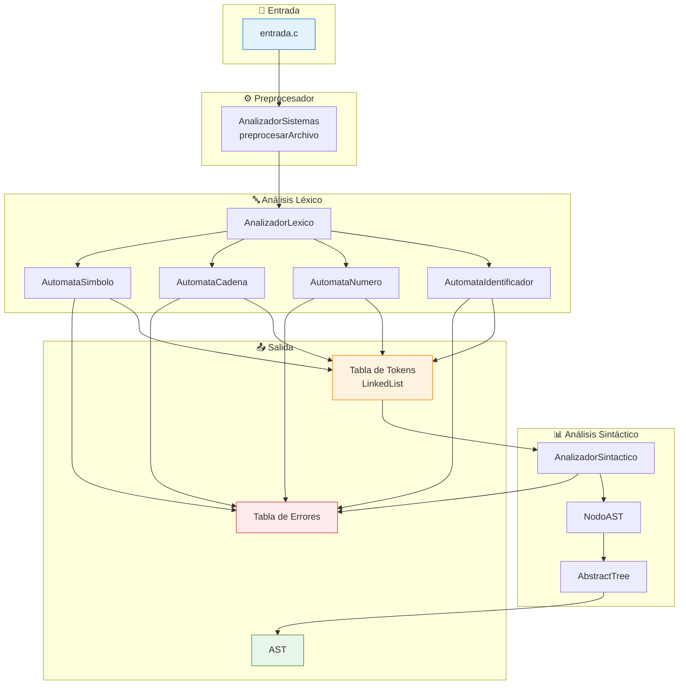

### Estructura de Directorios

```
SoftwareDeSistemas/
├── AnalizadorSistemas.java          # Punto de entrada, preprocesador
├── entrada.c                         # Archivo de prueba
├── salida_limpia.txt                 # Archivo preprocesado
├── T1_Equipo_Desarrollo_de_Funciones/
│   └── src/
│       ├── lexico/
│       │   ├── AnalizadorLexico.java
│       │   ├── AutomataIdentificador.java
│       │   ├── AutomataNumero.java
│       │   ├── AutomataCadena.java
│       │   ├── AutomataSimbolo.java
│       │   ├── Token.java
│       │   ├── TipoToken.java
│       │   ├── LinkedList.java
│       │   ├── Nodo.java
│       │   ├── TablaErrores.java
│       │   ├── TipoError.java
│       │   └── ErrorLexico.java
│       └── sintactico/
│           ├── AnalizadorSintactico.java
│           ├── NodoAST.java
│           └── AbstractTree.java
```

---

## Fase 1: Preprocesamiento

### Propósito

Elimina comentarios, normaliza espacios en blanco y prepara el archivo para el análisis léxico.

### Funcionalidades

| Característica | Descripción |
|----------------|-------------|
| Comentarios de línea | Elimina líneas que comienzan con `//` |
| Comentarios de bloque | Elimina contenido entre `/*` y `*/` |
| Normalización | Reduce múltiples espacios/tabs a uno solo |

### Implementación

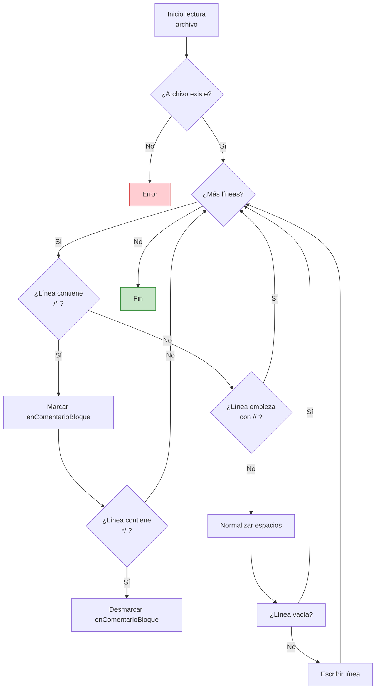

### Código Principal (`AnalizadorSistemas.java:58-121`)

```java
public static void preprocesarArchivo(String rutaOrigen, String rutaDestino) {
    // 1. Lee línea por línea
    // 2. Detecta y elimina comentarios de bloque /* */
    // 3. Elimina comentarios de línea //
    // 4. Normaliza espacios múltiples
    // 5. Escribe resultado en archivo destino
}
```

---
  if (t.lexema.equals("(")) {
                    next();
                    NodoAST exp = 
## Fase 2: Análisis Léxico

### Propósito

Convierte la secuencia de caracteres en una lista ordenada de **tokens** (unidades léxicas significativas).

### Tokens Reconocidos

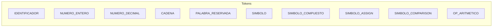

### Palabras Reservadas

| Palabra | Descripción |
|---------|-------------|
| `entero`, `flotante`, `cadena`, `booleano`, `void` | Tipos de datos |
| `si`, `sino`, `hacer`, `mientras` | Control de flujo |
| `leer`, `escribir` | Entrada/Salida |

### Autómatas Implementados

#### 1. AutomataIdentificador

Reconoce identificadores y palabras reservadas.

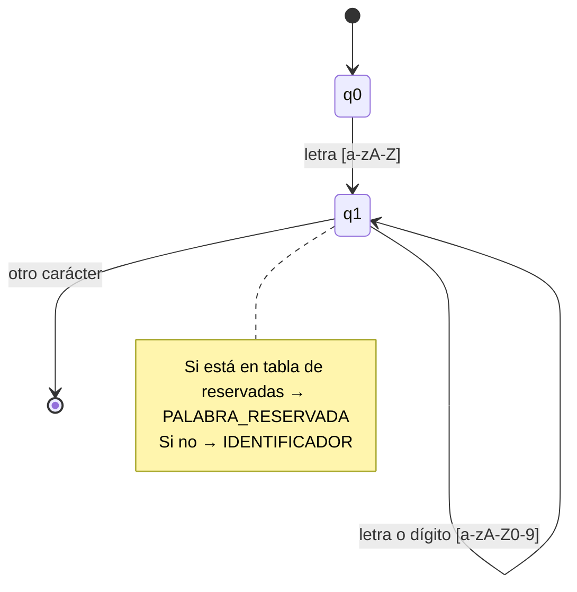

#### 2. AutomataNumero

Reconoce números enteros y decimales.

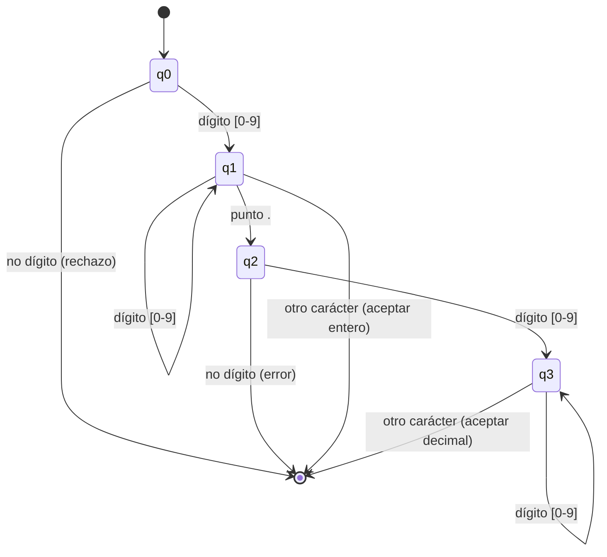

#### 3. AutomataCadena

Reconoce literales de cadena entre comillas.

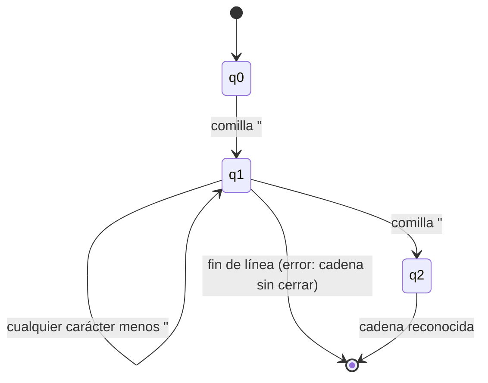

#### 4. AutomataSimbolo

Reconoce símbolos simples y compuestos.

```mermaid
flowchart TD
    A[Inicio] --> B{¿2 caracteres<br/>disponibles?}
    B -->|Sí| C{¿Es símbolo<br/>compuesto?}
    C -->|Sí| D[SIMBOLO_COMPUESTO<br/>++ -- \|\| && ->]
    C -->|No| E{¿Es operador<br/>comparación?}
    E -->|Sí| F[SIMBOLO_COMPARISON<br/>>= <= == !=]
    E -->|No| G{¿Es asignación<br/>compuesta?}
    G -->|Sí| H[SIMBOLO_ASSIGN<br/>+= -= *= /=]
    G -->|No| I[Operador simple]
    B -->|No| I
    I --> J{¿Aritmético?}
    J -->|Sí| K[OP_ARITMETICO<br/>+ - * /]
    J -->|No| L{¿Asignación?}
    L -->|Sí| M[SIMBOLO_ASSIGN<br/>=]
    L -->|No| N{¿Otro símbolo?}
    N -->|Sí| O[SIMBOLO<br/>( ) { } ; , &]
    N -->|No| P[No reconocido]
    
    style D fill:#e3f2fd
    style F fill:#fff3e0
    style K fill:#e8f5e9
    style O fill:#fce4ec
    style P fill:#ffcdd2
```

### Flujo del Análisis Léxico

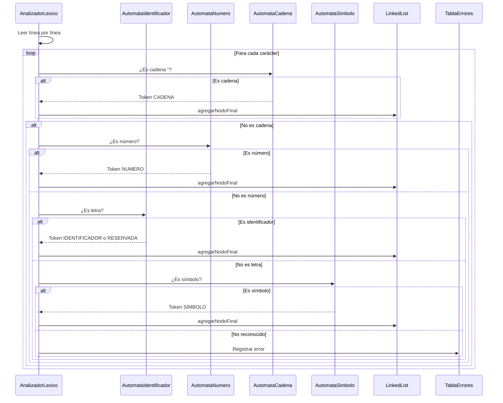

### Manejo de Errores Léxicos

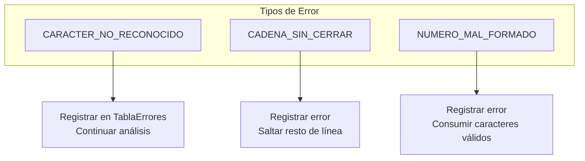

### Estructuras de Datos del Léxico

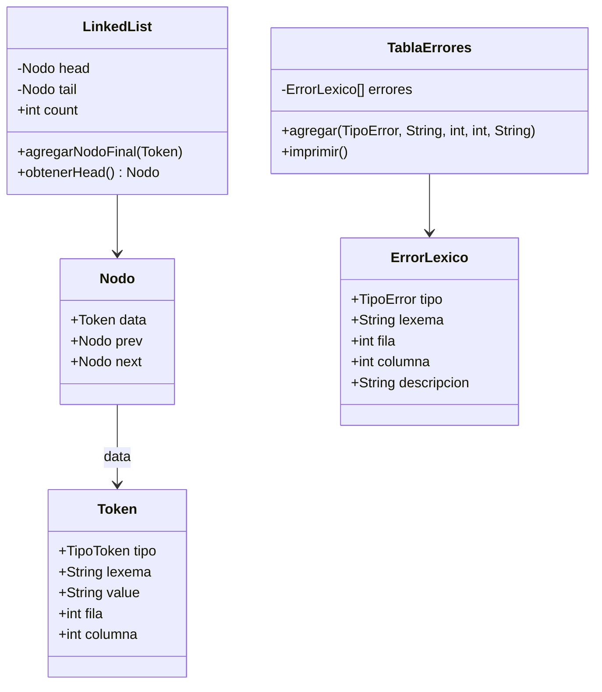

---

## Fase 3: Análisis Sintáctico

### Propósito

Verifica que la secuencia de tokens forme oraciones válidas según la gramática del lenguaje y construye el Árbol Sintáctico Abstracto (AST).

### Tipo de Parser

**Parser Descendente Recursivo** (top-down, sin backtracking en la mayoría de casos).

### Gramática del Lenguaje (BNF Simplificado)

```mermaid
flowchart TB
    subgraph Gramática
        P[PROGRAMA] --> D1[DECLARACION]
        D1 --> D2[DECLARACION]
        D1 --> ε
        
        D2 --> DV[declaracionVariable]
        D2 --> AS[asignacion]
        D2 --> ES[escribir]
        D2 --> SI[si]
        
        DV --> T[tipo]
        T -->|"entero"| TE[ENTERO]
        T -->|"flotante"| TF[FLOTANTE]
        T -->|"cadena"| TC[CADENA]
        T -->|"booleano"| TB[BOOLEANO]
        T -->|"void"| TV[VOID]
        
        DV --> ID[identificador]
        DV -->|"main ("| PAR[parametros]
        PAR -->|")"| B[bloque]
        
        B -->|"{"| S1[SENTENCIA]
        B -->|"}"| ε
        S1 --> S2[SENTENCIA]
        S1 --> ε
        
        SI -->|"si ("| C[condicion]
        SI -->|")"| B2[bloque]
        
        ES -->|"escribir ("| ARG[argumentos]
        ES -->|")"| ;[;]
        
        ARG --> E[expresion]
        ARG -->|","| ARG2[argumentos]
        ARG --> ε
        
        E --> T1[termino]
        E -->|"+"| T2[termino]
        E -->|"-"| T3[termino]
    end
```

### Reglas de Producción Implementadas

```java
programa        → declaracion*
declaracion     → declaracionVariable | asignacion | escribir | si
declaracionVariable → tipo identificador ("=" expresion)? ";" 
                    | tipo "main" "(" ")" bloque
asignacion      → identificador ("=" | "+=" | "-=" | "*=" | "/=") expresion ";"
escribir        → "escribir" "(" expresion ("," expresion)* ")" ";"
si              → "si" "(" expresion ")" bloque
bloque          → "{" declaracion* "}"
expresion       → termino (opAritmetico | opComparacion)* | expresion "&&" expresion | expresion "||" expresion
termino         → factor
factor          → NUMERO | IDENTIFICADOR | CADENA | "(" expresion ")" | "&" identificador
tipo            → "entero" | "flotante" | "cadena" | "booleano" | "void"
```

### Estructura del Parser

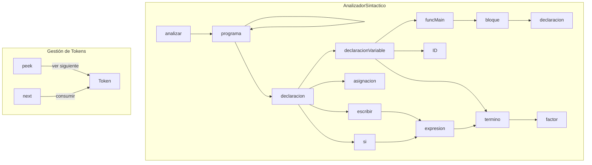

### Manejo de Errores Sintácticos

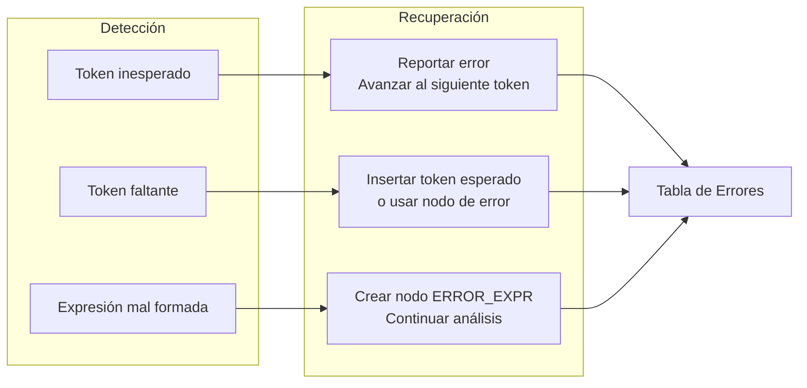

---

## Fase 4: Generación del AST

### Propósito

Construir una representación jerárquica del programa que captura la estructura sintáctica.

### Estructura del Nodo AST

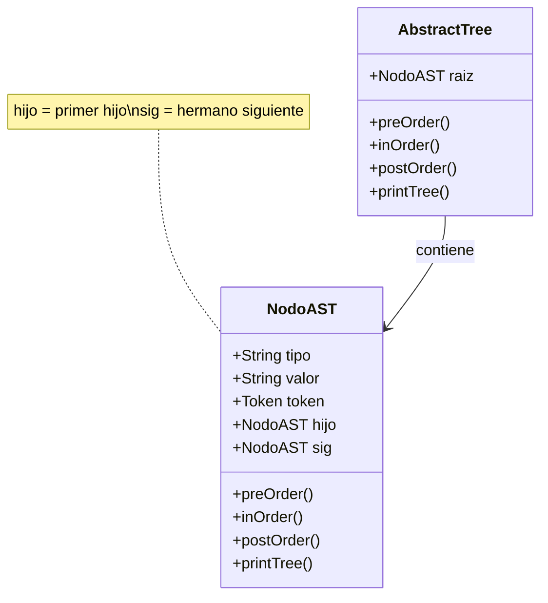

### Tipos de Nodos del AST

| Tipo de Nodo | Descripción | Hijos |
|--------------|-------------|-------|
| `PROGRAMA` | Raíz del árbol | Declaraciones |
| `FUNCION_MAIN` | Función principal | Bloque |
| `DECLARACION_*` | Declaración de variable | Identificador, valor |
| `ASIGNACION` | Asignación simple o compuesta | Identificador, valor |
| `ESCRIBIR` | Llamada a función escribir | Argumentos |
| `SI` | Estructura condicional | Condición, bloque |
| `BLOQUE` | Bloque de código | Sentencias |
| `OP_*` | Operadores | Operando izquierdo, derecho |
| `ID` | Identificador | - |
| `NUMERO` | Literal numérico | - |
| `CADENA` | Literal de cadena | - |
| `REF` | Referencia (&) | - |

### Ejemplo: AST del archivo `entrada.c`

```
entrada.c:
---
entero main() {
    flotante x = 5.67;
    x += 1;
    cadena nombre = "Juan Carlos Bodoque";
    si (x > 10) {
        escribir("%d es mayor a 5", &x);
    }
}
```

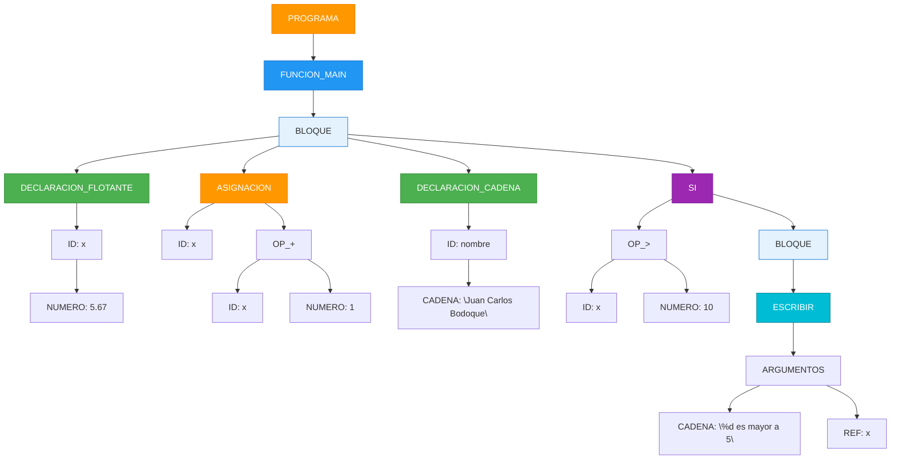

### Recorridos del AST

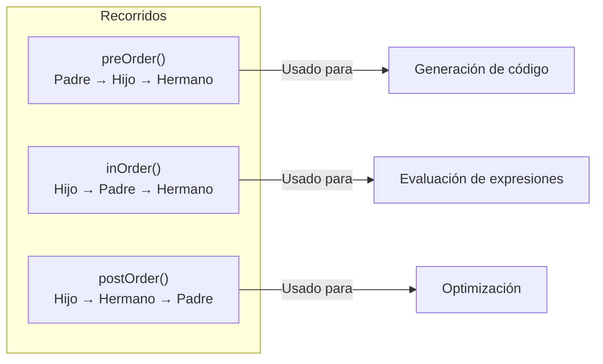

---

## Ejecución del Compilador

### Compilación y Ejecución

```bash
cd T1_Equipo_Desarrollo_de_Funciones

# Compilar
javac -d bin src/AnalizadorSistemas.java src/lexico/*.java src/sintactico/*.java

# Ejecutar
java -cp bin AnalizadorSistemas
```

### Salida Esperada

```
Archivo preprocesado con éxito.

===== TABLA DE SIMBOLOS =====
PALABRA_RESERVADA -> entero (1,1)
IDENTIFICADOR -> main (1,8)
SIMBOLO -> ( (1,12)
SIMBOLO -> ) (1,13)
...
Total de tokens: 35

===== AST =====
PROGRAMA
└── FUNCION_MAIN
    └── BLOQUE
        └── DECLARACION_FLOTANTE
            └── ID: x
                └── NUMERO: 5.67
        └── ASIGNACION
            └── ID: x
                └── OP_+
                    └── ID: x
                        └── NUMERO: 1
        └── DECLARACION_CADENA
            └── ID: nombre
                └── CADENA: "Juan Carlos Bodoque"
        └── SI
            └── OP_>
                └── ID: x
                    └── NUMERO: 10
            └── BLOQUE
                └── ESCRIBIR
                    └── ARGUMENTOS
                        └── CADENA: "%d es mayor a 5"
                            └── REF
                                └── ID: x

========== TABLA DE ERRORES LEXICOS ==========
  No se encontraron errores lexicos.
==============================================
```

---

## Estados Pendientes

### Fases por Implementar

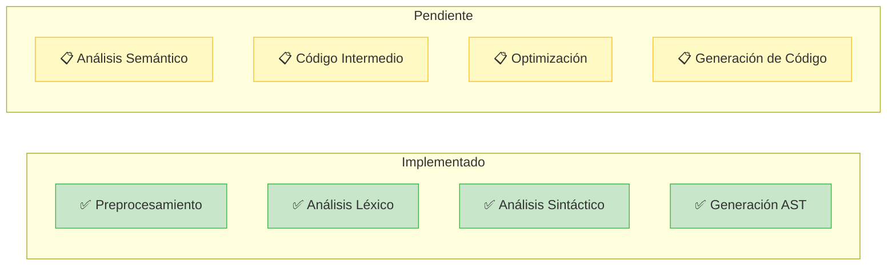

### Análisis Semántico (Por implementar)

| Componente | Descripción |
|------------|-------------|
| **Tabla de símbolos** | Almacenar variables, tipos, alcances |
| **Verificación de tipos** | Comprobar compatibilidad de operandos |
| **Control de alcances** | Verificar variables definidas |
| **Verificación de funciones** | Parámetros y retorno correctos |

### Código Intermedio (Por implementar)

| Representación | Descripción |
|----------------|-------------|
| **Código de tres direcciones** | Expresiones binarias en forma `x = y op z` |
| **Notación postfija** | Para evaluación de expresiones |
| **Representación SSA** | Forma estática de una sola asignación |

### Generación de Código (Por implementar)

- Generación de código ensamblador o bytecode
- Máquina virtual o código objeto
- Optimizaciones específicas de arquitectura

---

## Anexo: Referencia de Clases

### Módulo Léxico

| Clase | Responsabilidad |
|-------|-----------------|
| `AnalizadorLexico` | Coordina el análisis, lee archivo línea por línea |
| `AutomataIdentificador` | Reconoce identificadores y palabras reservadas |
| `AutomataNumero` | Reconoce números enteros y decimales |
| `AutomataCadena` | Reconoce literales de cadena |
| `AutomataSimbolo` | Reconoce operadores y símbolos |
| `Token` | Representa una unidad léxica |
| `TipoToken` | Enum con tipos de tokens |
| `LinkedList` | Lista enlazada para almacenar tokens |
| `TablaErrores` | Colección de errores léxicos |
| `TipoError` | Enum con tipos de errores |

### Módulo Sintáctico

| Clase | Responsabilidad |
|-------|-----------------|
| `AnalizadorSintactico` | Parser descendente recursivo |
| `NodoAST` | Nodo del árbol sintáctico |
| `AbstractTree` | Contenedor del AST completo |

---

*Documentación generada para el proyecto de Software de Sistemas*
